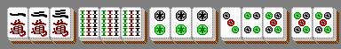

### [696. Mahjong](https://projecteuler.net/problem=696)

The game of Mahjong is played with tiles belonging to $s$ *suits*. Each tile also has a *number* in the range $1\ldots n$, and for each suit/number combination there are exactly four indistinguishable tiles with that suit and number. (The real Mahjong game also contains other bonus tiles, but those will not feature in this problem.)

A *winning hand* is a collection of $3t+2$ Tiles (where $t$ is a fixed integer) that can be arranged as $t$ *Triples* and one *Pair*, where:

- A *Triple* is either a *Chow* or a *Pung*
- A *Chow* is three tiles of the same suit and consecutive numbers
- A *Pung* is three identical tiles (same suit and same number)
- A *Pair* is two identical tiles (same suit and same number)

For example, here is a winning hand with $n=9$, $s=3$, $t=4$, consisting in this case of two Chows, two Pungs, and one Pair:

Note that sometimes the same collection of tiles can be represented as $t$ Triples and one Pair in more than one way. This only counts as one winning hand. For example, this is considered to be the same winning hand as above, because it consists of the same tiles:

Let $w(n, s, t)$ be the number of distinct winning hands formed of $t$ Triples and one Pair, where there are $s$ suits available and tiles are numbered up to $n$.

For example, with a single suit and tiles numbered up to 4, we have $w(4, 1, 1) = 20$: there are 12 winning hands consisting of a Pung and a Pair, and another 8 containing a Chow and a Pair. You are also given that $w(9, 1, 4) = 13259$, $w(9, 3, 4) = 5237550$, and $w(1000, 1000, 5) \equiv 107662178 \pmod{1\,000\,000\,007}$.

Find $w(10^8, 10^8, 30)$. Give your answer modulo $1\,000\,000\,007$.

### 696. 麻将

麻将游戏的牌共有 $s$ 种*花色*，每一张牌上都有 $1 \sim n$ 范围内的一个正整数，称为*点数*。对任意花色-点数的组合，都恰有四张完全相同的牌（现实中的麻将游戏中还有字牌、花牌，但是本题中不考虑它们）。

当玩家拥有了一副有 $3t+2$ 张牌的牌组，且这个牌组能被整理为 $t$ 副*三对子*与一副*对子*，玩家就能*胡牌*。其中定义：[^1]

- *三对子*要么是一副*顺子*，要么是一副*刻子*。
- 三张点数连续、花色相同的牌称作一副*顺子*。
- 三张点数相同、花色相同的牌称作一副*刻子*。
- 两张点数相同、花色相同的牌称作一副*对子*。

下图的牌组满足 $n=9$、$s=3$、$t=4$，且能胡牌（由两副顺子、两副刻子、一副对子组成）。

注意到有时候相同的一副牌可以通过不同的方式被整理为 $t$ 副三对子与一副对子，但是这种牌应只被计数一次。下图的牌组也能胡牌，但由于其牌型构成与上图中的牌完全一致，故被认为与上图重复：

记 $w(n, s, t)$ 为满足如下条件的不同的牌组数：由 $t$ 副三对子与一副对子组成、有 $s$ 个可用花色、最大点数为 $n$ 且可以胡牌。

例如 $w(4, 1, 1) = 20$，因为一共有 12 个由一副刻子、一副对子组成的可胡牌的牌组；8 个由一副顺子、一副对子组成的可胡牌的牌组。亦已知 $w(9, 1, 4) = 13259$、$w(9, 3, 4) = 5237550$ 且 $w(1000, 1000, 5) \equiv 107662178 \pmod{1\,000\,000\,007}$。

求 $w(10^8, 10^8, 30)$ 模 $1\,000\,000\,007$ 之值。

[^1]: 所有麻将相关术语（除「点数」「三对子」）的译名参照《中国麻将竞赛规则（1998 年 7 月版）》。

---

点 [这个链接](https://fsy-juruo.github.io/pe-chinese-translation/) 回到源站。

点 [这个链接](https://fsy-juruo.github.io/pe-chinese-translation/detailed_content_archives.html) 回到详细版题目目录。