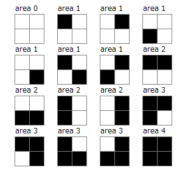

### [701. Random Connected Area](https://projecteuler.net/problem=701)

Consider a rectangle made up of $W \times H$ square cells each with area $1$.  
Each cell is independently coloured black with probability $0.5$ otherwise white. Black cells sharing an edge are assumed to be connected.  
Consider the maximum area of connected cells.

Define $E(W,H)$ to be the expected value of this maximum area.
For example, $E(2,2)=1.875$, as illustrated below.

You are also given $E(4, 4) = 5.76487732$, rounded to $8$ decimal places.

Find $E(7, 7)$, rounded to $8$ decimal places.

### 701. 随机连通块的面积

考虑一个由 $W$ 行 $H$ 列的单位正方形方格构成的矩形网格。  
每个方格独立地以 $0.5$ 的概率被染黑，未染黑的方格均是白的。若两个黑色方格共享一条边，则认为它们连通。  

考察连通黑色方格的最大面积，我们记 $E(W,H)$ 为该最大面积的期望。例如，根据下图所述，可得 $E(2,2)=1.875$。

你亦已知 $E(4, 4)$ 四舍五入至小数点后第 $8$ 位后的值为 $5.76487732$。

求 $E(7, 7)$ 四舍五入至小数点后第 $8$ 位后的值。

---

点 [这个链接](https://fsy-juruo.github.io/pe-chinese-translation/) 回到源站。

点 [这个链接](https://fsy-juruo.github.io/pe-chinese-translation/detailed_content_archives.html) 回到详细版题目目录。
