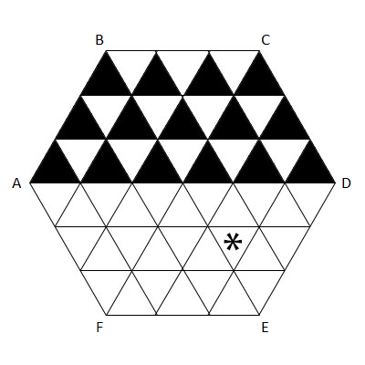

### [702. Jumping Flea](https://projecteuler.net/problem=702)

A regular hexagon table of side length $N$ is divided into equilateral triangles of side length $1$. The picture below is an illustration of the case $N = 3$.

An flea of negligible size is jumping on this table. The flea starts at the centre of the table. Thereafter, at each step, it chooses one of the six corners of the table, and jumps to the mid-point between its current position and the chosen corner.

For every triangle $T$, we denote by $J(T)$ the minimum number of jumps required for the flea to reach the interior of $T$. Landing on an edge or vertex of $T$ is not sufficient.

For example, $J(T) = 3$ for the triangle marked with a star in the picture: by jumping from the centre half way towards F, then towards C, then towards E.

Let $S(N)$ be the sum of $J(T)$ for all the upper-pointing triangles $T$ in the upper half of the table. For the case $N = 3$, these are the triangles painted black in the above picture.

You are given that $S(3) = 42$, $S(5) = 126$, $S(123) = 167178$, and $S(12345) = 3185041956$.

Find $S(123456789)$.

### 702. 跳蚤

一边长是 $N$ 的正六边形的桌面被划分成若干边长是 $1$ 的等边三角形区域。下图展示了 $N = 3$ 时的划分。

一只大小可忽略不计的跳蚤正在这桌面上跳跃。它以桌面的中心为起点，并在此后的每一步中，任选该正六边形的一个顶点，并跳向该顶点与自己所在位置的中点。

对每个三角形 $T$，我们记 $J(T)$ 为：跳蚤进入 $T$ 内部所需的最少跳跃次数，跳到 $T$ 的顶点或边上不算做进入 $T$ 内部。

例如，对上图中标 \* 号的三角形 $T$，有 $J(T) = 3$：跳蚤只需在三次跳跃中，依次选择顶点 F、C、E 即可。

记 $S(N)$ 为全体 $J(T)$ 的和，其中 $T$ 取遍所有位于桌面上半部分的”朝上“的三角形。$N = 3$ 时，需考虑的三角形即为上图中被涂黑的三角形。

你已知 $S(3) = 42$、$S(5) = 126$、$S(123) = 167178$、$S(12345) = 3185041956$。

求 $S(123456789)$。

---

点 [这个链接](https://fsy-juruo.github.io/pe-chinese-translation/) 回到源站。

点 [这个链接](https://fsy-juruo.github.io/pe-chinese-translation/detailed_content_archives.html) 回到详细版题目目录。
