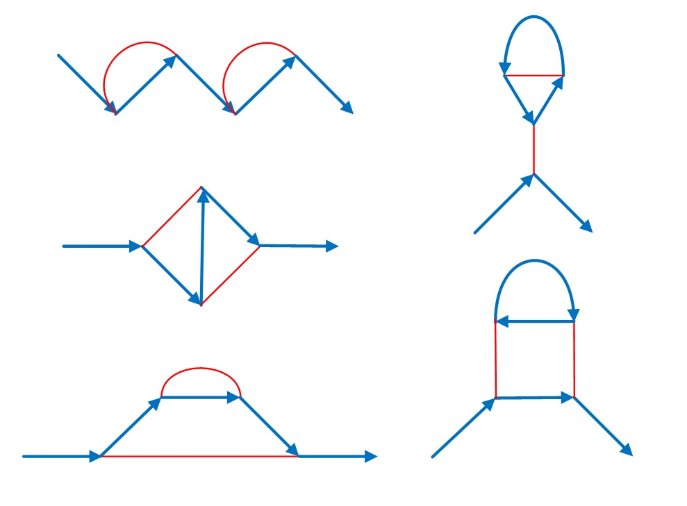

### [781. Feynman Diagrams](https://projecteuler.net/problem=781)

Let $F(n)$ be the number of connected graphs with blue edges (directed) and red edges (undirected) containing:

* two vertices of degree 1, one with a single outgoing blue edge and the other with a single incoming blue edge.
* $n$ vertices of degree 3, each of which has an incoming blue edge, a <b>different</b> outgoing blue edge and a red edge.

For example, $F(4)=5$ because there are 5 graphs with these properties:

You are also given $F(8)=319$.

Find $F(50\,000)$. Give your answer modulo $1\,000\,000\,007$.

NOTE: Feynman diagrams are a way of visualising the forces between elementary particles. Vertices represent interactions. The blue edges in our diagrams represent matter particles (e.g. electrons or positrons) with the arrow representing the flow of charge. The red edges (normally wavy lines) represent the force particles (e.g. photons). Feynman diagrams are used to predict the strength of particle interactions.

### 781. 费曼图

记 $F(n)$ 为由若干条蓝色有向边与红色无向边组成的，满足下述条件的连通图个数。 

* 有两个度数为 1 的结点。其中一个结点和一条蓝色出边关联，另一个结点和一条蓝色入边关联。
* 有 $n$ 个度数为 3 的节点。这 3 个度数分别来自一条入边、一条出边与一条无向边，且入边与出边**不同**。

例如 $F(4)=5$，这 $5$ 张符合要求的图如下：

已知 $F(8)=319$。

求 $F(50\,000)$ 模 $1\,000\,000\,007$ 之值。

注：费曼图是一种可视化“基本”粒子之间作用力的一种方法。每个顶点表示两个粒子的作用。蓝色有向边表示一个实物粒子（如电子、正电子），其方向表示电荷流向。红色边（一般是波浪形的）表示力场粒子（如光子）。费曼图可用于预测粒子作用力的强度。

---

点 [这个链接](https://fsy-juruo.github.io/pe-chinese-translation/) 回到源站。

点 [这个链接](https://fsy-juruo.github.io/pe-chinese-translation/detailed_content_archives.html) 回到详细版题目目录。

