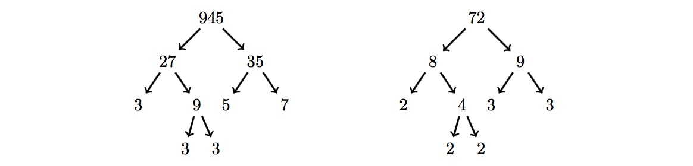

### [829. Integral Fusion](https://projecteuler.net/problem=829)

Given any integer $n \gt 1$ a *binary factor tree* $T(n)$ is defined to be:

* A tree with the single node $n$ when $n$ is prime.
* A binary tree that has root node $n$, left subtree $T(a)$ and right subtree $T(b)$, when $n$ is not prime. Here $a$ and $b$ are positive integers such that $n = ab$, $a\le b$ and $b-a$ is the smallest.

For example $T(20)$:

We define $M(n)$ to be the smallest number that has a factor tree identical in shape to the factor tree for $n!!$, the **double factorial** of $n$.

For example, consider $9!! = 9\times 7\times 5\times 3\times 1 = 945$. The factor tree for $945$ is shown below together with the factor tree for $72$ which is the smallest number that has a factor tree of the same shape. Hence $M(9) = 72$.

Find $\displaystyle\sum_{n=2}^{31} M(n)$.

### 829. 整数合成

对于任意整数 $n \gt 1$，其*二叉因子树* $T(n)$ 定义如下：

* $n$ 是质数时，该树只有 1 个节点 $n$。
* $n$ 不是质数时，$T(n)$ 的根为 $n$，左子树、右子树分别为 $T(a)$、$T(b)$。其中正整数 $a, b$ 满足 $n=ab$，$a \leq b$，且 $b - a$ 最小。

如下图为 $T(20)$：

记 $M(n)$ 为满足如下条件的最小整数：该数的二叉因子树与 $n!!$（$n$ 的双阶乘）的二叉因子树形状完全一致。如下图，$n = 9$ 时，$9!! = 9\times 7\times 5\times 3\times 1 = 945$。$945$ 的二叉因子树与 $72$ 的二叉因子树形状完全一致，而且 $72$ 是满足此条件的最小正整数，故 $M(9) = 72$。

求 $\displaystyle\sum_{n=2}^{31} M(n)$。

---

点 [这个链接](https://fsy-juruo.github.io/pe-chinese-translation/) 回到源站。

点 [这个链接](https://fsy-juruo.github.io/pe-chinese-translation/detailed_content_archives.html) 回到详细版题目目录。