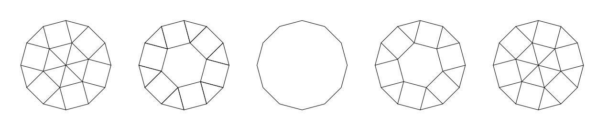

### [867. Tiling Dodecagon](https://projecteuler.net/problem=867)

There are 5 ways to tile a regular dodecagon of side 1 with regular polygons of side 1.

Let $T(n)$ be the number of ways to tile a regular dodecagon of side $n$ with regular polygons of side 1. Then $T(1) = 5$. You are also given $T(2) = 48$.

Find $T(10)$. Give your answer modulo $10^9+7$.

### 867. 密铺十二边形

用边长为 $1$ 的正多边形密铺边长为 $1$ 的正十二边形，共有 $5$ 种不同方法，如下图：

记 $T(n)$ 为：用边长为 $1$ 的正多边形密铺边长为 $n$ 的正十二边形，不同方法的数量。于是 $T(1) = 5$，已知 $T(2) = 48$。

求 $T(10)$ 模 $(10^9+7)$ 的值。

---

点 [这个链接](https://fsy-juruo.github.io/pe-chinese-translation/) 回到源站。

点 [这个链接](https://fsy-juruo.github.io/pe-chinese-translation/detailed_content_archives.html) 回到详细版题目目录。