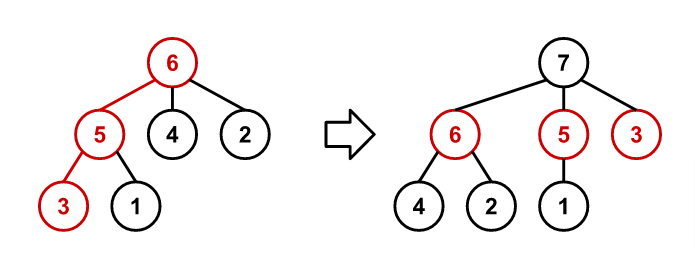

### [872. Recursive Tree](https://projecteuler.net/problem=872)

A sequence of rooted trees $T_n$ is constructed such that $T_n$ has $n$ nodes numbered $1$ to $n$.

The sequence starts at $T_1$, a tree with a single node as a root with the number $1$.

For $n > 1$, $T_n$ is constructed from $T_{n-1}$ using the following procedure:

- Trace a path from the root of $T_{n-1}$ to a leaf by following the largest-numbered child at each node.
- Remove all edges along the traced path, disconnecting all nodes along it from their parents.
- Connect all orphaned nodes directly to a new node numbered $n$, which becomes the root of $T_n$.

For example, the following figure shows $T_6$ and $T_7$. The path traced through $T_6$ during the construction of $T_7$ is coloured red.

Let $f(n, k)$ be the sum of the node numbers along the path connecting the root of $T_n$ to the node $k$, including the root and the node $k$. For example, $f(6, 1) = 6 + 5 + 1 = 12$ and $f(10, 3) = 29$.

Find $f(10^{17}, 9^{17})$.

### 872. 递归生成的树

我们按如下规则生成一列有根树 $\{T_n\}$，使得 $T_n$ 恰有标号为 $1 \sim n$ 的 $n$ 个结点。初始时，$T_1$ 是只含 $1$ 号结点且以该结点为根的有根树。

对诸 $n > 1$，我们按如下流程，用 $T_{n-1}$ 构造 $T_n$：

- 从 $T_{n-1}$ 的根节点开始，不断走向标号最大的子节点，直到走到叶子节点，得到一条路径。
- 删去这条路径上的所有边。
- 新建一个 $n$ 号结点作为根结点，并将该点向该路径上的所有结点连一条边，得到新树 $T_n$。

下图展示了用 $T_6$ 构造出 $T_7$ 的过程，第一步中走出的路径已被标红。

记 $f(n, k)$ 为：从 $T_n$ 的根节点到 $k$ 号结点的最短路径上，所有结点（包括根节点、$k$ 号结点）标号的和。例如，$f(6, 1) = 6 + 5 + 1 = 12$、$f(10, 3) = 29$。

求 $f(10^{17}, 9^{17})$。

---

点 [这个链接](https://fsy-juruo.github.io/pe-chinese-translation/) 回到源站。

点 [这个链接](https://fsy-juruo.github.io/pe-chinese-translation/detailed_content_archives.html) 回到详细版题目目录。
