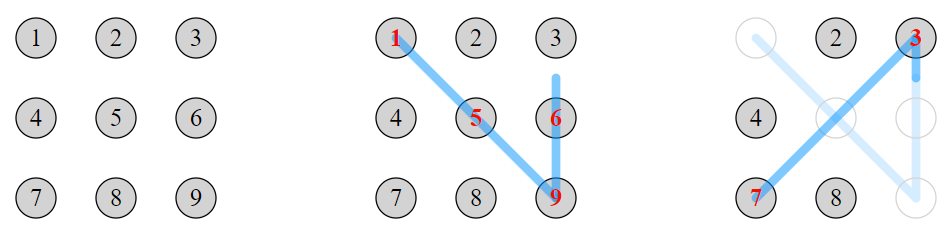

### [879. Touch-screen Password](https://projecteuler.net/problem=879)

A touch-screen device can be unlocked with a "password" consisting of a sequence of two or more distinct spots that the user selects from a rectangular grid of spots on the screen. The user enters their sequence by touching the first spot, then tracing a straight line segment to the next spot, and so on until the end of the sequence. The user's finger remains in contact with the screen throughout, and may only move in straight line segments from spot to spot.

If the finger traces a straight line that passes over an intermediate spot, then that is treated as two line segments with the intermediate spot included in the password sequence. For example, on a $3\times 3$ grid labelled with digits $1$ to $9$ (shown below), tracing $1-9$ is interpreted as $1-5-9$.

Once a spot has been selected it disappears from the screen. Thereafter, the spot may not be used as an endpoint of future line segments, and it is ignored by any future line segments which happen to pass through it. For example, tracing $1-9-3-7$ (which crosses the $5$ spot twice) will give the password $1-5-9-6-3-7$.

There are $389488$ different passwords that can be formed on a $3 \times 3$ grid.

Find the number of different passwords that can be formed on a $4 \times 4$ grid.

### 879. 触屏密码

用户可通过在屏幕矩形点阵上，选取两个或多个不同点组成的序列作为“图案密码”来解锁触屏设备。输入密码时，用户需触摸第一个点，然后沿直线方向移动到下一个点，如此继续，直至完成序列。整个过程中，手指必须保持接触屏幕，且只能沿点与点之间的线段移动。

如果手指划过的线段途经其它中间点，我们将视其为两段以该中间点为分界的线段，并将该中间点加入序列。例如，在标有数字 $1$ 至 $9$ 的 $3 \times 3$ 点阵中，从 $1$ 划到 $9$ 的操作将被理解为从 $1$ 划到 $5$ 再划到 $9$（见下图）。

格点一被接触就会从屏幕上消失，从此再也不能作为某次移动的终点和中心点被加入序列。例如，若按 $1-9-3-7$ 的顺序设置密码，那么该过程会经过 $5$ 两次，最终得到 $[1, 5, 9, 6, 3, 7]$ 作为密码。

在 $3 \times 3$ 的点阵中，可以设置 $389488$ 种不同的图案密码。

请问：在 $4 \times 4$ 的点阵中，可以设置多少种不同的图案密码？

---

点 [这个链接](https://fsy-juruo.github.io/pe-chinese-translation/) 回到源站。

点 [这个链接](https://fsy-juruo.github.io/pe-chinese-translation/detailed_content_archives.html) 回到详细版题目目录。