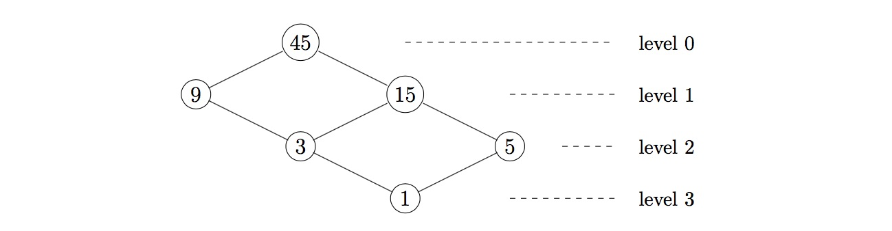

### [881. Divisor Graph Width](https://projecteuler.net/problem=881)

For a positive integer $n$ create a graph using its divisors as vertices. An edge is drawn between two vertices $a \lt b$ if their quotient $b/a$ is prime. The graph can be arranged into levels where vertex $n$ is at level $0$ and vertices that are a distance $k$ from $n$ are on level $k$. Define $g(n)$ to be the maximum number of vertices in a single level. 

The example above shows that $g(45) = 2$. You are also given $g(5040) = 12$.

Find the smallest number, $n$, such that $g(n) \ge 10^4$.

### 881. 因子图的宽度

我们可以用一个正整数 $n$，利用如下规则构造其因子图：将 $n$ 的所有因子作为该图的所有节点；若两个节点 $a, b (a < b)$ 满足 $b/a$ 是质数，则在 $a, b$ 之间连一条无向边。这图可以被分为若干层，其中节点 $n$ 在第 $0$ 层，所有与节点 $n$ 的最短路为 $k$ 的节点均在第 $k$ 层。记 $g(n)$ 为 $n$ 的因子图中，某层中含有节点数的最大值。

上图表明 $g(45) = 2$，又已知：$g(5040) = 12$。

求满足 $g(n) \ge 10^4$ 的最小正整数 $n$。

---

点 [这个链接](https://fsy-juruo.github.io/pe-chinese-translation/) 回到源站。

点 [这个链接](https://fsy-juruo.github.io/pe-chinese-translation/detailed_content_archives.html) 回到详细版题目目录。