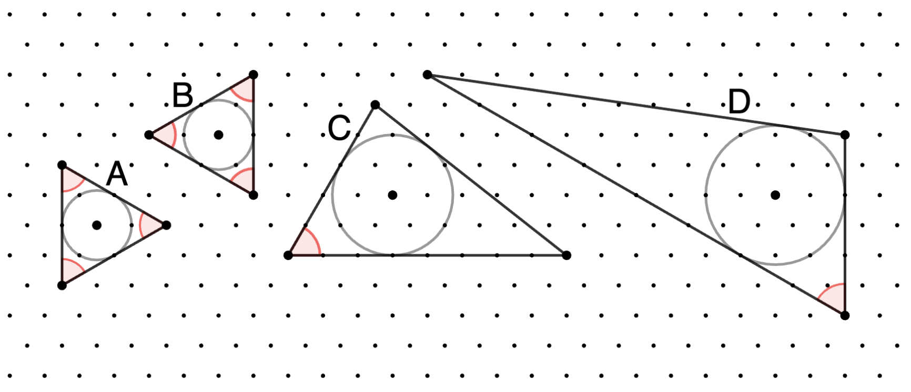

### [883. Remarkable Triangles](https://projecteuler.net/problem=883)

In this problem we consider triangles drawn on a **hexagonal lattice**, where each lattice point in the plane has six neighbouring points equally spaced around it, all distance $1$ away.

We call a triangle *remarkable* if

- All three vertices and its **incentre** lie on lattice points
- At least one of its angles is $60^\circ$

Above are four examples of remarkable triangles, with $60^\circ$ angles illustrated in red. Triangles A and B have inradius $1$; C has inradius $\sqrt{3}$; D has inradius $2$.

Define $T(r)$ to be the number of remarkable triangles with inradius $\le r$. Rotations and reflections, such as triangles A and B above, are counted separately; however direct translations are not. That is, the same triangle drawn in different positions of the lattice is only counted once.

You are given $T(0.5)=2$, $T(2)=44$, and $T(10)=1302$.

Find $T(10^6)$.

### 883. 显著三角形

在本题中，我们考虑如下六边形网格：对于每个格点，其周围都有 6 个与其相距 1 个单位长度的相邻格点，且这 6 个点呈正六边形分布。

我们称某六边形网格上的三角形是 *显著的*，当且仅当：

- 它的三个顶点和内心都是格点。
- 它至少有一个内角是 $60^\circ$。

上图中，A、B、C、D 四个三角形都是显著三角形，它们的内切圆半径分别是 $1$、$1$、$\sqrt{3}$、$2$。

记 $T(r)$ 为内切圆半径 $\le r$ 的显著三角形的个数，经旋转、镜像翻转后才相同的两个三角形（如上图中 A、B 两个三角形）被认为是不同的，但是经平移后完全相同的两个三角形被认为是相同的。已知：$T(0.5)=2$、$T(2)=44$、$T(10)=1302$。

求 $T(10^6)$。

---

点 [这个链接](https://fsy-juruo.github.io/pe-chinese-translation/) 回到源站。

点 [这个链接](https://fsy-juruo.github.io/pe-chinese-translation/detailed_content_archives.html) 回到详细版题目目录。