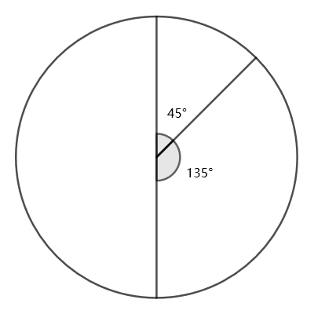

### [891. Ambiguous Clock](https://projecteuler.net/problem=891)

A round clock only has three hands: hour, minute, second. All hands look identical and move continuously. Moreover, there is no number or reference mark so that the "upright position" is unknown. The clock functions the same as a normal 12-hour analogue clock.

Despite the inconvenient design, for most time it is possible to tell the correct time (within a 12-hour cycle) from the clock, just by measuring accurately the angles between the hands. For example, if all three hands coincide, then the time must be 12:00:00.

Nevertheless, there are several moments where the clock shows an ambiguous reading. For example, the following moment could be either 1:30:00 or 7:30:00 (with the clock rotated $180^\circ$). Thus both 1:30:00 and 7:30:00 are ambiguous moments.

Note that even if two hands perfectly coincide, we can still see them as two distinct hands in the same position. Thus for example 3:00:00 and 9:00:00 are not ambiguous moments.

How many ambiguous moments are there within a 12-hour cycle?

### 891. 显时不明的时钟

现有一个显时不明的时钟：它的时针、分针和秒针形状相同，难以分辨。表盘上也没有任何刻度，我们也无法得知其摆放的正面。除此之外，它和一个正常的 12 小时时钟完全一致。

虽然这种设计极不方便，但是大多数情况下，我们可以通过测量三根指针之间的夹角来确定时钟目前所指的时刻。例如，如果这时钟的三根指针完全重合，那这时钟所指的时刻只会是 12:00:00。（非整秒时刻不计）

但在某些情况下，我们确实无法完全确定其所指的时刻。例如，在下图所示的情况中，这个时钟所指的时刻可能是 1:30:00 或 7:30:00，因为你只需要将时钟旋转 180° 就能实现两个时刻间的转换。所以，我们称 1:30:00 和 7:30:00 均为 *模糊时刻*。

需要注意的是：我们认为重合在一起的指针是能够分辨的。因此，3:00:00 和 9:00:00 就不是模糊时刻。

请问在 12 个小时中，有多少个模糊时刻？

---

点 [这个链接](https://fsy-juruo.github.io/pe-chinese-translation/) 回到源站。

点 [这个链接](https://fsy-juruo.github.io/pe-chinese-translation/detailed_content_archives.html) 回到详细版题目目录。

