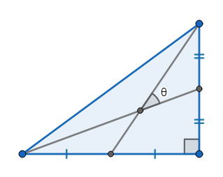

### [904. Pythagorean Angle](https://projecteuler.net/problem=904)

Given a right-angled triangle with integer sides, the smaller angle formed by the two medians drawn on the the two perpendicular sides is denoted by $\theta$.

Let $f(\alpha, L)$ denote the sum of the sides of the right-angled triangle minimizing the absolute difference between $\theta$ and $\alpha$ among all right-angled triangles with integer sides and hypotenuse not exceeding $L$.  
If more than one triangle attains the minimum value, the triangle with the maximum area is chosen. All angles in this problem are measured in degrees.

For example, $f(30,10^2)=198$ and $f(10,10^6)= 1600158$.

Define $F(N,L)=\sum_{n=1}^{N}f\left(\sqrt[3]{n},L\right)$.   
You are given $F(10,10^6)= 16684370$.

Find $F(45000, 10^{10})$.

### 904. 毕达哥拉斯角

给定三边长为正整数的直角三角形，我们作出两条直角边上的中位线，并将这两条中位线所成的较小的一个夹角记为 $\theta$。

我们记 $f(\alpha, L)$ 为：所有斜边长度 $\leq L$ 的直角三角形中，$|\theta - \alpha|$ 最小的一个三角形的三边长度之和。如果有多个三角形使得 $|\theta - \alpha|$ 最小，则取其中面积最大的一个。本题中所有的角度以度（°）为单位。

例如，$f(30,10^2)=198$、$f(10,10^6)= 1600158$。

记 $F(N,L)=\sum_{n=1}^{N}f\left(\sqrt[3]{n},L\right)$，已知 $F(10,10^6)= 16684370$。

求 $F(45000, 10^{10})$。

---

点 [这个链接](https://fsy-juruo.github.io/pe-chinese-translation/) 回到源站。

点 [这个链接](https://fsy-juruo.github.io/pe-chinese-translation/detailed_content_archives.html) 回到详细版题目目录。

