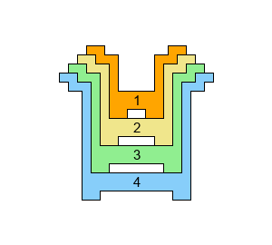
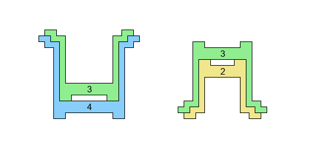
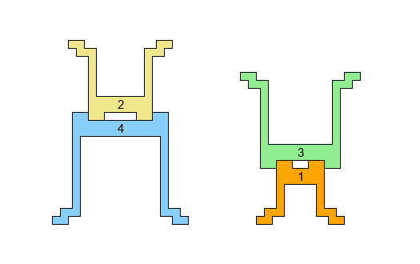
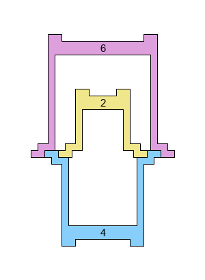
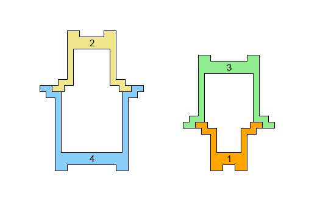

### [907. Stacking Cups](https://projecteuler.net/problem=907)

An infant's toy consists of $n$ cups, labelled $C_1,\dots,C_n$ in increasing order of size.

The cups may be stacked in various combinations and orientations to form towers. The cups are shaped such that the following means of stacking are possible:

- Nesting: $C_k$ may sit snugly inside $C_{k+1}$.

- Base-to-base: $C_{k+2}$ or $C_{k-2}$ may sit, right-way-up, on top of an up-side-down $C_k$, with their bottoms fitting together snugly.

- Rim-to-rim: $C_{k+2}$ or $C_{k-2}$ may sit, up-side-down, on top of a right-way-up $C_k$, with their tops fitting together snugly.

- For the purposes of this problem, it is **not** permitted to stack **both** $C_{k+2}$ and $C_{k-2}$ rim-to-rim on top of $C_k$, despite the schematic diagrams appearing to allow it:  

Define $S(n)$ to be the number of ways to build a single tower using all $n$ cups according to the above rules.
You are given $S(4)=12$, $S(8)=58$, and $S(20)=5560$.

Find $S(10^7)$, giving your answer modulo $1\,000\,000\,007$.

### 907. 堆叠杯子

某款婴儿叠叠杯玩具由 $n$ 个杯子组成，将这些杯子从小到大分别记为 $C_1, \cdots, C_n$。

我们可以任意组合杯子，把它们按不同的朝向堆叠在一起，形成多种杯塔。得益于这些杯子的特殊形状，你可以按如下规则堆叠杯子：

- 嵌套：$C_k$ 可以套进 $C_{k+1}$ 中，且二者紧密贴合。

- 杯底对杯底：正放的 $C_{k+2}$ 或 $C_{k-2}$ 可以放在倒置的 $C_k$ 上，且小杯子的杯底能够紧密地嵌入大杯子杯底中的中空部分。

- 杯沿对杯沿：倒置的 $C_{k+2}$ 或 $C_{k-2}$ 可以放在正放的 $C_k$ 上，二者的杯沿紧密贴合。

- 即使理论上如下叠放是可行的，但在本题中，你 **不允许** 将 $C_{k+2}$ 和 $C_{k-2}$ **同时** 按杯沿对杯沿的方式放在 $C_k$ 上。

记 $S(n)$ 为：依照如上规则，用这 $n$ 个杯子可以搭成的杯塔总数。已知：$S(4)=12$、$S(8)=58$、$S(20)=5560$。

求 $S(10^7)$ 模 $1\,000\,000\,007$ 的值。

---

点 [这个链接](https://fsy-juruo.github.io/pe-chinese-translation/) 回到源站。

点 [这个链接](https://fsy-juruo.github.io/pe-chinese-translation/detailed_content_archives.html) 回到详细版题目目录。

