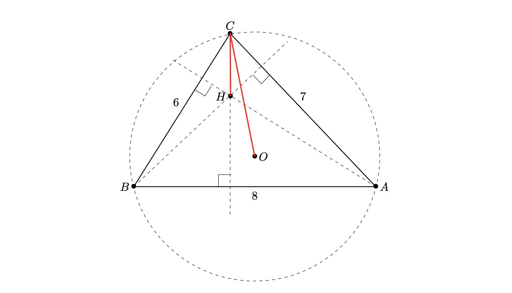

### [919. Fortunate Triangles](https://projecteuler.net/problem=919)

We call a triangle *fortunate* if it has integral sides and at least one of its vertices has the property that the distance from it to the triangle's **orthocentre** is exactly half the distance from the same vertex to the triangle's **circumcentre**.

Triangle $ABC$ above is an example of a fortunate triangle with sides $(6,7,8)$. The distance from the vertex $C$ to the circumcentre $O$ is $\approx 4.131182$, while the distance from $C$ to the orthocentre $H$ is half that, at $\approx 2.065591$.

Define $S(P)$ to be the sum of $a+b+c$ over all fortunate triangles with sides $a\leq b\leq c$ and perimeter not exceeding $P$.

For example $S(10)=24$, arising from three triangles with sides $(1,2,2)$, $(2,3,4)$, and $(2,4,4)$. You are also given $S(100)=3331$.

Find $S(10^7)$.

### 919. 幸运三角形

若一个三角形满足如下要求，则称其是 *幸运的*：

- 它的三条边的长度都是整数。
- 至少有一个顶点满足：它到这个三角形垂心的距离恰是它到这个三角形外心的距离的一半。

上图中的三角形 $ABC$ 就是一个幸运三角形：其三条边的长度分别是 $6, 7, 8$；顶点 $C$ 到外心 $O$ 的距离约为 $4.131182$，恰是 $C$ 到垂心 $H$ 的距离（约为 $2.065591$）的两倍。

记 $S(P)$ 为：对所有周长 $\leq P$，三边长分别为 $a \leq b \leq c$ 的幸运三角形，$a + b + c$ 的和。已知 $S(10)=24$，因为三边长是 $(1,2,2)$、$(2,3,4)$ 和 $(2,4,4)$ 的三角形都是幸运的。你还知道 $S(100)=3331$。

求 $S(10^7)$。

---

点 [这个链接](https://fsy-juruo.github.io/pe-chinese-translation/) 回到源站。

点 [这个链接](https://fsy-juruo.github.io/pe-chinese-translation/detailed_content_archives.html) 回到详细版题目目录。