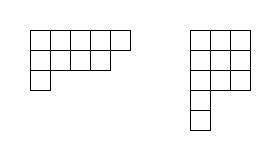
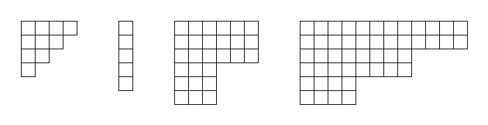
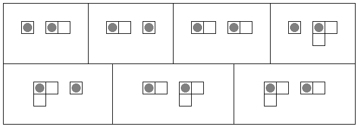

### [923. Young's Game B](https://projecteuler.net/problem=923)

A **Young diagram** is a finite collection of (equally-sized) squares in a grid-like arrangement of rows and columns, such that

- the left-most squares of all rows are aligned vertically;
- the top squares of all columns are aligned horizontally;
- the rows are non-increasing in size as we move top to bottom;
- the columns are non-increasing in size as we move left to right.

Two examples of Young diagrams are shown below.

Two players Right and Down play a game on several Young diagrams, all disconnected from each other. Initially, a token is placed in the top-left square of each diagram. Then they take alternating turns, starting with Right. On Right's turn, Right selects a token on one diagram and moves it **one square** to the right. On Down's turn, Down selects a token on one diagram and moves it **one square** downwards. A player unable to make a legal move on their turn loses the game.

For $a,b,k\geq 1$ we define an *$(a,b,k)$-staircase* to be the Young diagram where the bottom-right frontier consists of $k$ *steps* of vertical height $a$ and horizontal length $b$. Shown below are four examples of staircases with $(a,b,k)$ respectively $(1,1,4),$ $(5,1,1),$ $(3,3,2),$ $(2,4,3)$.

Additionally, define the *weight* of an $(a,b,k)$-staircase to be $a+b+k$.

Let $S(m, w)$ be the number ways of choosing $m$ staircases, each having weight not exceeding $w$, upon which Right (moving first in the game) will win the game assuming optimal play. Different orderings of the same set of staircases are to be counted separately.

For example, $S(2, 4)=7$ is illustrated below, with tokens as grey circles drawn in their initial positions.

You are also given $S(3, 9)=315319$.

Find $S(8, 64)$ giving your answer modulo $10^9+7$.

### 923. 杨氏游戏 B

所谓 **杨氏图表（杨图）**，指的是由有限个（完全相同的）正方形按网格状排列，形成若干行和列，并满足如下要求的图形：

- 各横行的最左侧对齐。
- 各竖列的最上方对齐。
- 每一行所含的正方形数从上至下不增。
- 每一列所含的正方形数从左至右不增。

如下是两个杨图：

两位玩家，小右和小下，正在若干个彼此不交的杨图上玩游戏。一开始，它们在每个杨图的左上角的格子上放置一枚代币。随后，由小右执先手，二人轮流进行操作。如果轮到小右操作，他可以选择一枚代币，把它在所在的杨图上向右移动 **一格**。如果轮到小下操作，他可以选择一枚代币，把它在所在的杨图上向下移动 **一格**。无法进行合法操作的玩家输掉游戏。

对正整数 $a, b, k \geq 1$，定义一个 *$(a, b, k)$-阶梯* 为满足如下条件的杨图：该杨图各行最右侧、各列最下方的格子位于右下方的两条边组成的边界构成了一个 $k$ 级 *台阶*，每级台阶的高是 $b$、长是 $a$。下图是四个阶梯的例子，其 $(a, b, k)$ 值分别是 $(1,1,4)$、$(5,1,1)$、$(3,3,2)$、$(2,4,3)$。

另外，我们定义一个 $(a, b, k)$-阶梯的 *权重* 是 $a + b + k$。

我们记 $S(m, w)$ 为：小右、小下选择 $m$ 个权重 $\leq w$ 的阶梯进行游戏，二人都以最优策略操作，最终小右获胜的情况下，选择阶梯的方案数。相同阶梯组成的不同排列分别计数。

已知 $S(2, 4) = 7$，七种方案见下图，其中灰色圆圈表示处于初始位置的代币：

已知 $S(3, 9)=315319$。

求 $S(8, 64)$ 模 $(10^9+7)$ 的值。

---

点 [这个链接](https://fsy-juruo.github.io/pe-chinese-translation/) 回到源站。

点 [这个链接](https://fsy-juruo.github.io/pe-chinese-translation/detailed_content_archives.html) 回到详细版题目目录。