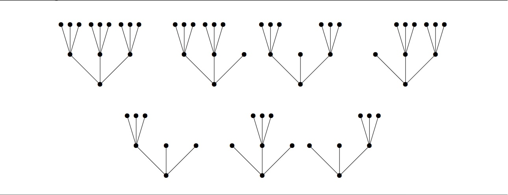

### [927. Prime-ary Tree](https://projecteuler.net/problem=927)

A full $k$-ary tree is a tree with a single root node, such that every node is either a leaf or has exactly $k$ ordered children.  The **height** of a $k$-ary tree is the number of edges in the longest path from the root to a leaf.

For instance, there is one full 3-ary tree of height 0, one full 3-ary tree of height 1, and seven full 3-ary trees of height 2. These seven are shown below.

For integers $n$ and $k$ with $n\ge 0$ and $k \ge 2$, define $t_k(n)$ to be the number of full $k$-ary trees of height $n$ or less.   
Thus, $t_3(0) = 1$, $t_3(1) = 2$, and $t_3(2) = 9$. Also, $t_2(0) = 1$, $t_2(1) = 2$, and $t_2(2) = 5$.

Define $S_k$ to be the set of positive integers $m$ such that $m$ divides $t_k(n)$ for some integer $n\ge 0$.  For instance, the above values show that 1, 2, and 5 are in $S_2$ and 1, 2, 3, and 9 are in $S_3$.

Let $S = \bigcap_p S_p$ where the intersection is taken over all primes $p$.  Finally, define $R(N)$ to be the sum of all elements of $S$ not exceeding $N$.  You are given that $R(20) = 18$ and $R(1000) = 2089$.

Find $R(10^7)$.

### 927. 质数多叉树

若一棵有根树满足：其中结点要么是叶子结点、要么恰有 $k$ 个有序的子节点，则称该树是一棵 满 $k$ 叉树[^1]。对一棵 $k$ 叉树，定义其 **高** 为从根节点到任意叶子结点的最长路径中的边数。

[^1]: 部分资料中会混淆[满 $k$ 叉树 (full $k$-ary tree)](https://xlinux.nist.gov/dads/HTML/fullBinaryTree.html) 和[完美 $k$ 叉树 (perfect $k$-ary tree)](https://xlinux.nist.gov/dads/HTML/perfectBinaryTree.html) 这两个概念，请读者注意区分。由于本题中已经直接给出定义，所以我们直接将 full $k$-ary tree 直译为满 $k$ 叉树。

例如，高为 $0$、$1$ 的满 $3$ 叉树都只有 $1$ 棵，而高为 $2$ 的满 $3$ 叉树有 $7$ 棵，下图展示了这 $7$ 棵树：

对满足 $n\ge 0$、$k \ge 2$ 的整数 $n$、$k$，记 $t_k(n)$ 为：高 $\leq n$ 的满 $k$ 叉树的数量。于是可得 $t_3(0) = 1$、$t_3(1) = 2$、$t_3(2) = 9$，亦可得 $t_2(0) = 1$、$t_2(1) = 2$、$t_2(2) = 5$。

定义 $S_k$ 为满足如下条件的正整数 $m$ 的集合：存在整数 $n \geq 0$ 使得 $m$ 整除 $t_k(n)$。例如，根据上述取值可得 $1, 2, 5 \in S_2$、$1, 2, 3, 9 \in S_3$。

记 $S = \bigcap_p S_p$，其中下标 $p$ 取遍全体质数。最后定义 $R(N)$ 为 $S$ 中全体 $\leq N$ 的元素之和。已知：$R(20) = 18$、$R(1000) = 2089$。

求 $R(10^7)$。

---

点 [这个链接](https://fsy-juruo.github.io/pe-chinese-translation/) 回到源站。

点 [这个链接](https://fsy-juruo.github.io/pe-chinese-translation/detailed_content_archives.html) 回到详细版题目目录。

