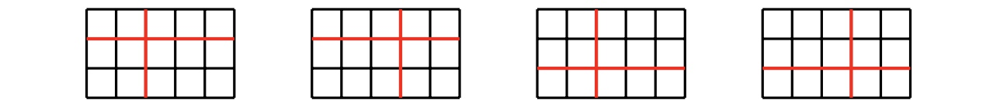

### [933. Paper Cutting](https://projecteuler.net/problem=933)

Starting with one piece of integer-sized rectangle paper, two players make moves in turn.  
A valid move consists of choosing one piece of paper and cutting it **both** horizontally and vertically, so that it becomes four pieces of smaller rectangle papers, all of which are integer-sized.  
The player that does not have a valid move loses the game.

Let $C(w, h)$ be the number of winning moves for the first player, when the original paper has size $w \times h$. For example, $C(5,3)=4$, with the four winning moves shown below.

Also write $\displaystyle D(W, H) = \sum_{w = 2}^W\sum_{h = 2}^H C(w, h)$. You are given that $D(12, 123) = 327398$.

Find $D(123, 1234567)$.

### 933. 剪纸游戏

现有一张长、宽都是整数的矩形纸，两名玩家轮流进行剪纸操作。每一次操作中，玩家可以选择一片纸，将其沿水平方向、竖直方向 **各剪一刀**，将其剪成四块 **长、宽都是整数的** 小纸片。无法操作的玩家失败。

记 $C(w, h)$ 为：若初始时纸的长为 $w$、宽为 $h$，能让先手获胜的第一次操作的数量。例如 $C(5, 3) = 4$，如下是 $4$ 个能让先手获胜的第一次操作：

再置 $\displaystyle D(W, H) = \sum_{w = 2}^W\sum_{h = 2}^H C(w, h)$，已知 $D(12, 123) = 327398$。

求 $D(123, 1234567)$。

---

点 [这个链接](https://fsy-juruo.github.io/pe-chinese-translation/) 回到源站。

点 [这个链接](https://fsy-juruo.github.io/pe-chinese-translation/detailed_content_archives.html) 回到详细版题目目录。