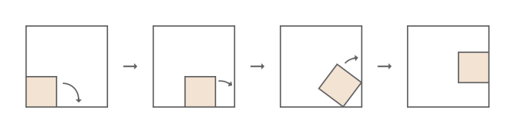

### [935. Rolling Square](https://projecteuler.net/problem=863)

A square of side length $b < 1$ is rolling around the inside of a larger square of side length $1$, always touching the larger square but without sliding.  
Initially the two squares share a common corner. At each step, the small square rotates clockwise about a corner that touches the large square, until another of its corners touches the large square. Here is an illustration of the first three steps for $b = \frac5{13}$.

For some values of $b$, the small square may return to its initial position after several steps. For example, when $b = \frac12$, this happens in $4$ steps; and for $b = \frac5{13}$ it happens in $24$ steps.

Let $F(N)$ be the number of different values of $b$ for which the small square first returns to its initial position within at most $N$ steps. For example, $F(6) = 4$, with the corresponding $b$ values:
$$
\frac12,\quad 2 - \sqrt 2,\quad 2 + \sqrt 2 - \sqrt{2 + 4\sqrt2},\quad  8 - 5\sqrt2 + 4\sqrt3 - 3\sqrt6,
$$
the first three in $4$ steps and the last one in $6$ steps. Note that it does not matter whether the small square returns to its original **orientation**.  
Also $F(100) = 805$.

Find $F(10^8)$.

### 935. 滚动正方形

现有一边长为 $b < 1$ 的小正方形在一个边长为 $1$ 的大正方形内进行无滑动的滚动。初始时两个正方形共用一个内角。接下来的每一步中，小正方形会以某个在大正方形上的顶点为旋转中心，进行顺时针旋转，直至另一个顶点碰到大正方形。

下图展示了 $b = \frac{5}{13}$ 时的前三步旋转：

对于某些 $b$ 值，小正方形可能会在若干次旋转后回到初始位置。例如，$b = \frac{1}{2}$ 时，小正方形会在 $4$ 次旋转后回到原位。而 $b = \frac{5}{13}$ 时则需要 $24$ 次旋转。

记 $F(N)$ 为：能让小正方形在 $\leq N$ 次旋转后回到原位的 $b$ 的取值数。例如 $F(6) = 4$。因为 $b = \frac12, 2 - \sqrt 2, 2 + \sqrt 2 - \sqrt{2 + 4\sqrt2}$ 时，小正方形会在 $4$ 次旋转后回到原位。$b = 8 - 5\sqrt2 + 4\sqrt3 - 3\sqrt6$ 时，小正方形会在 $6$ 次旋转后回到原位。除此之外没有其他情况。注意：小正方形返回原位时，其朝向不必和初始时的朝向相同。

亦已知 $F(100) = 805$。

求 $F(10^8)$。

---

点 [这个链接](https://fsy-juruo.github.io/pe-chinese-translation/) 回到源站。

点 [这个链接](https://fsy-juruo.github.io/pe-chinese-translation/detailed_content_archives.html) 回到详细版题目目录。