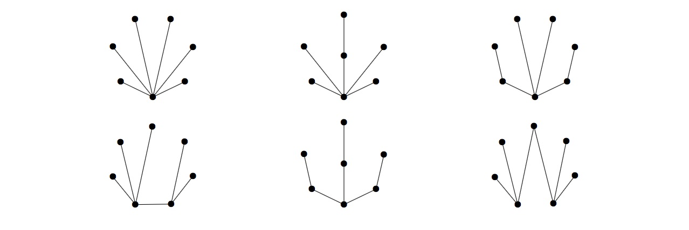

### [936. Peerless Trees](https://projecteuler.net/problem=936)

A *peerless tree* is a tree with no edge between two vertices of the same degree. Let $P(n)$ be the number of peerless trees on $n$ unlabelled vertices.

There are six of these trees on seven unlabelled vertices, $P(7)=6$, shown below.

Define $\displaystyle S(N)  = \sum_{n=3}^N P(n)$. You are given $S(10) = 74$.

Find $S(50)$.

### 936. 无同树 [^1]

[^1]: 这个翻译取自 Richard Xu (sx349) 的翻译。

若一棵树满足：其中任意两个度数相同的节点之间没有连边，则称该树是一棵 *无同树*。记 $P(n)$ 为含 $n$ 个节点的无标号无同树的数量。

例如 $P(7)=6$，下图展示了这 $6$ 棵无标号无同树。

记 $\displaystyle S(N)  = \sum_{n=3}^N P(n)$，已知 $S(10) = 74$。

求 $S(50)$。

---

点 [这个链接](https://fsy-juruo.github.io/pe-chinese-translation/) 回到源站。

点 [这个链接](https://fsy-juruo.github.io/pe-chinese-translation/detailed_content_archives.html) 回到详细版题目目录。

