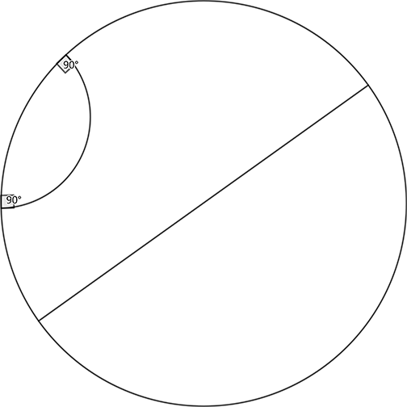

### [972. Hyperbolic Plane](https://projecteuler.net/problem=972)

The **hyperbolic plane** can be represented by the **open unit disc**, namely the set of points $(x, y)$ in $\Bbb R^2$ with $x^2 + y^2 < 1$.

A **geodesic** is defined as either a diameter of the open unit disc or a circular arc contained within the disc that is orthogonal to the boundary of the disc. 
The following diagram shows the hyperbolic plane with two geodesics; one is a diameter and the other is a circular arc.

Let $\mathcal V(N)$ be the set of points $(x, y)$ such that $x^2 + y^2 \lt 1$ and $x, y$ are both rational numbers with denominator not exceeding $N$.

Let $T(N)$ be the number of ordered triples $(P, Q, R)$ such that $P, Q, R$ are three different points in $\mathcal V(N)$ and there is a hyperbolic line passing through all of them.  
For example, $T(2) = 24$ and $T(3) = 1296$.

Find $T(12)$.

### 972. 双曲平面

**双曲平面** 可以用一个 **开单位圆盘** 表示，即 $\mathbb{R}^2$ 中全体满足 $x^2 + y^2 < 1$ 的点 $(x, y)$ 之集合。

该平面的 **测地线** 或是该圆盘的一条直径，或是一条垂直于该圆盘边界的圆弧。下图展示了一个双曲平面和它的两条测地线，其中一条是直径、一条是圆弧。

记 $\mathcal V(N)$ 为全体满足 $x^2 + y^2 < 1$ 且二者分母都不超过 $N$ 的有理点 $(x, y)$ 的集合。

记 $T(N)$ 为满足如下条件的有序三元组 $(P, Q, R)$ 数量：$P, Q, R$ 是  $\mathcal V(N)$ 中三个不同的点，且存在一条测地线同时经过这三个点。例如 $T(2) = 24$、$T(3) = 1296$。

求 $T(12)$。

---

点 [这个链接](https://fsy-juruo.github.io/pe-chinese-translation/) 回到源站。

点 [这个链接](https://fsy-juruo.github.io/pe-chinese-translation/detailed_content_archives.html) 回到详细版题目目录。