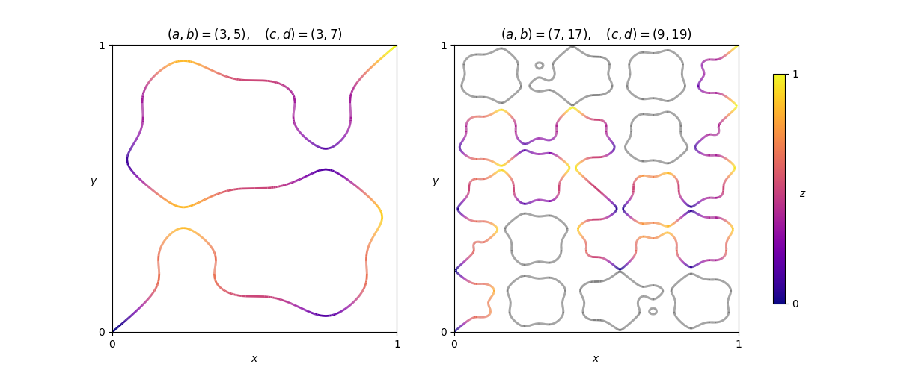

### [975. A Winding Path](https://projecteuler.net/problem=975)

Given a pair $(a,b)$ of **coprime odd positive integers**, define the function
$$
H_{a,b}(x)=\frac{1}{2}-\frac{1}{2(a+b)}\Bigl(b\cos(a\pi x)+a\cos(b\pi x)\Bigr)
$$
It can be seen that $H_{a,b}(0)=0$, $H_{a,b}(1)=1$, and $0 < H_{a,b}(x) < 1$ for all $x$ strictly between $0$ and $1$.

Given two such pairs $(a,b)$ and $(c,d)$, paths of infinitesimal width traverse the unit cube internally through every point $(x,y,z)\in [0,1]^3$ such that $z=H_{a,b}(x)=H_{c,d}(y)$. Remarkably, it can be shown that the point $(0,0,0)$ is always connected to the opposite corner $(1,1,1)$. Furthermore, with the additional condition $\gcd(a+b,c+d)\in\{2,4\}$, it can be shown that there is exactly one path connecting the two points.

Shown above are two examples, as viewed from above the cube. That is, we see the paths projected onto the $xy$-plane, with corresponding $z$ values indicated with varying colour. In the second example some paths are coloured grey to indicate that, while they exist, they do not form part of the path from $(0,0,0)$ to $(1,1,1)$.

Define $F(a, b, c, d)$ to be the sum of the absolute changes in height (or $z$-coordinate) over all uphill and downhill sections of the path from $(0,0,0)$ to $(1,1,1)$. In the first example above, the path climbs $\approx4.00886$ over eleven uphill sections, and descends $\approx3.00886$ over ten downhill sections, giving $F(3,5,3,7)\approx7.01772$. You are also given $F(7,17,9,19)\approx 26.79578$.

Let $G(m, n)$ be the sum of $F(p,q,p,2q-p)$ over all pairs $(p,q)$ of primes, $m\leq p < q\leq n$. You are given $G(3, 20)\approx463.80866$.

Find $G(500,1000)$ giving your answer rounded to five digits after the decimal point.

### 975. 一条蜿蜒的路径

给定一对 **互质的正奇数** $(a, b)$，定义
$$
H_{a,b}(x)=\frac{1}{2}-\frac{1}{2(a+b)}\Bigl(b\cos(a\pi x)+a\cos(b\pi x)\Bigr)
$$

可以发现 $H_{a,b}(0)=0$、$H_{a,b}(1)=1$ 且对所有 $0 < x < 1$ 皆有 $0 < H_{a,b}(x) < 1$。

固定两对互质的正奇数 $(a,b)$、$(c,d)$，在单位正方体 $[0, 1]^3$ 内，作出一条宽度无限小的、经过全体满足 $z=H_{a,b}(x)=H_{c,d}(y)$ 的 $(x, y, z)$ 的路径。值得一提的是，可以证明，$(0, 0, 0)$ 总是和其对角 $(1, 1, 1)$ 连通，若进一步限制 $\gcd(a+b,c+d)\in\{2,4\}$，可以证明恰有一条连接这两个点的路径。

上图展示了两个例子。我们展示的是路径的顶视图，也就是说，我们将路径投影到 $xy$-面，并用不同的颜色标示路径中 $z$ 坐标不同的点。在第二个例子中，有一部分路径虽然存在，但并不是从 $(0,0,0)$ 到 $(1,1,1)$ 的路径上的一部分，所以我们将这部分路径标为灰色。

我们记：沿从 $(0, 0, 0)$ 到 $(1, 1, 1)$ 的唯一路径行进时，每次上坡、下坡时 $z$-坐标的变化量的绝对值之和。在上图的第一个例子中，共有 $11$ 次上坡，过程中 $z$-坐标的增量总和约为 $4.00886$；共有 $10$ 次下坡，过程中 $z$-坐标的减量总和约为 $3.00886$，从而 $F(3,5,3,7)\approx7.01772$。亦已知 $F(7,17,9,19)\approx 26.79578$。

记 $G(m, n)$ 为全体 $F(p,q,p,2q-p)$ 之和，其中 $(p, q)$ 取遍全体满足 $m \leq p < q \leq n$ 的质数对。已知 $G(3, 20)\approx463.80866$。

求 $G(500,1000)$，将答案四舍五入至小数点后第五位。 

---

点 [这个链接](https://fsy-juruo.github.io/pe-chinese-translation/) 回到源站。

点 [这个链接](https://fsy-juruo.github.io/pe-chinese-translation/detailed_content_archives.html) 回到详细版题目目录。