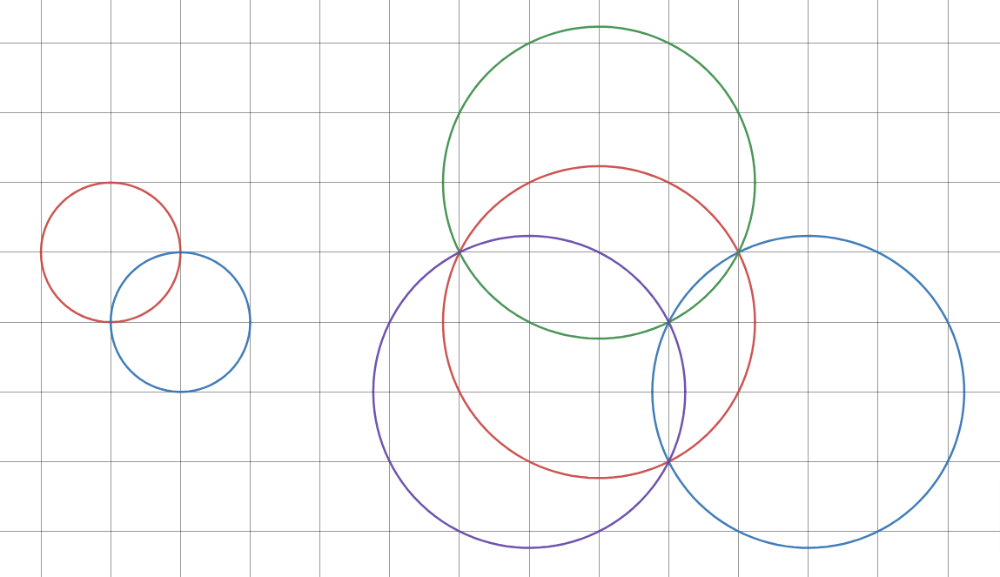

### [983. Consonant Circle Crossing](https://projecteuler.net/problem=983)

We say two circles on the plane *harmonise* if the circles intersect at two grid points, in which case the two intersection points are called the *harmony points*.

A set of circles on the plane is called *consonant* if it satisfies all the following requirements:  

- There are at least two circles in the set.
- The center point of every circle is a grid point.
- All circles have the same radius.
- No circle is tangent to any other circle.
- The circles are connected in the sense that a chain of circles can be formed between every pair of circles such that each circle harmonises with the next circle.

It can be proven that the number of unique harmony points of a consonant set of circles cannot be smaller than the number of circles. If the number of unique harmony points equals the number of circles, we say the consonant set is *perfect*.

For example, here are two perfect consonant sets of circles:

Let $R(n)$ be the minimal radius $r$ such that a perfect consonant set of $n$ or more circles with radius $r$ exists.  
You are given $R(2) = 1$ and $R(4) = \sqrt{5}$.

Find $R(500)^2$.

### 983. 协和圆的相交

如果平面上两个圆交于两个格点，我们则称这两个圆 *和谐*，这两个交点被称作 *和音点*。

若一个平面上的圆的集合（下简称圆集）满足以下所有条件，则称其是 *协和的*：

- 该集合中至少有两个圆。
- 每个圆的圆心都是一个格点。
- 所有圆的半径相同。
- 没有圆与其它圆相切。
- 这些圆是 “连通的”：对集合中任意两个圆，可以在其中插入其它集合中的圆组成一条 “链”，使得该链中任何圆都和后方与其相邻的圆和谐。

可以证明，对任何协和的圆集，其不同和音点的数量不小于圆的数量。如果不同和音点的数量恰等于圆的数量，则称该协和的圆集是 *完美的*。

下图展示了两例完美的协和的圆集：

记 $R(n)$ 表示：为使诸圆半径为 $r$、含 $\geq n$ 个圆的完美的协和圆集存在，所需 $r$ 的最小值。  
你已知 $R(2) = 1$、$R(4) = \sqrt{5}$。

求 $R(500)^2$。

---

点 [这个链接](https://fsy-juruo.github.io/pe-chinese-translation/) 回到源站。

点 [这个链接](https://fsy-juruo.github.io/pe-chinese-translation/detailed_content_archives.html) 回到详细版题目目录。
